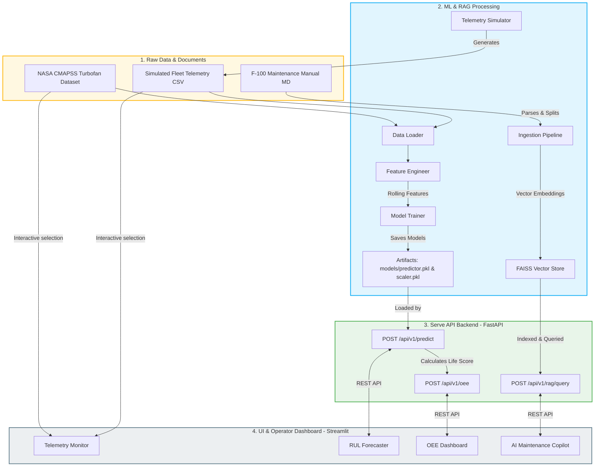

# 🏗️ Architecture Design & System Flow

This document details the software architecture, data pipelines, and service components of the **Industrial Predictive Maintenance Platform**.

---

## 📌 High-Level Architecture Diagram

The system consists of three main tiers:
1. **Machine Learning & Data Processing Pipeline**: Preprocesses sensor readings and trains a regressor.
2. **Serving Backend (FastAPI)**: Serves prediction scores, calculates manufacturing KPIs (OEE), and powers the RAG Knowledge Engine.
3. **Application Layer (Streamlit Dashboard)**: Connects to the backend to render dashboards and operator interfaces.

---

## 🛠️ Component Breakdown

### 1. Data Ingestion & Scaling (`src/pipeline/`)
*   **`data_loader.py`**: Reads NASA's space-delimited text logs. Safely handles trailing blanks and applies core schema mapping.
*   **`feature_engineering.py`**: Translates raw records into a historical timeseries window. Computes rolling averages and rolling standard deviations for the selected core sensor indices. Scales input spaces using `StandardScaler`.
*   **`train.py`**: Fits a Random Forest Regressor to estimate Remaining Useful Life (RUL). Evaluates model with RMSE and MAE before outputting serialization components.
*   **`inference.py`**: Performs predictions. Integrates CMAPSS test logic to evaluate accuracy against final cycle ground truths.

### 2. Retrieval-Augmented Generation (`src/rag/`)
*   **`ingestion.py`**: Reads maintenance instructions, segments sections via a recursive character text splitter, maps them into FAISS indices, and saves them locally.
*   **`retrieval.py`**: Intercepts search queries. Leverages local HuggingFace embeddings or OpenAI embeddings to select relevant manual blocks, compiling structured troubleshooting guides.

### 3. Serving Backend (`src/api/`)
*   **`main.py`**: FastAPI entrypoint mounting middleware and routes.
*   **`routes.py`**: Implements endpoints:
    *   `/predict`: Processes sequence readings to output expected RUL.
    *   `/oee`: Combines cycle metrics, RUL limits, and sensor core heat to evaluate Availability, Performance, Quality, and overall OEE.
    *   `/rag/query`: Connects natural language developer/operator questions to the RAG database.
*   **`schemas.py`**: Strongly-typed request/response models.

### 4. Interactive Operator Interface (`src/dashboard/app.py`)
*   Provides dynamic telemetry plotting, simulated forecasting, automated metrics panels, and a chat interface to the RAG assistant.
